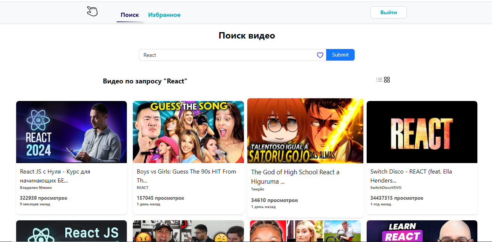

<!-- PROJECT LOGO -->
<br />
<div align="center">
  <a href="https://react.dev/">
    
  </a>

  <h3 align="center">Youtube-SPA</h3>
 <p align="center"> 
    <a href="https://github.com/pablitodon/YOUTUBE_SPA"><strong>Изучить документацию »</strong></a> 
    <br /> 
    <a href="https://github.com/othneildrew/Best-README-Template">Посмотреть демонстрацию</a> 
    · 
    <a href="https://github.com/pablitodon/YOUTUBE_SPA/issues/new">Сообщить об ошибке</a> 
  </p> 
</div>

<!-- ABOUT THE PROJECT -->

## О Проекте

[](https://example.com)

🎥 **YouTube SPA** — это современное одностраничное приложение, созданное для того, чтобы предоставить пользователям простой и удобный доступ к контенту YouTube.

🌟 **Основные возможности**:

- Поиск видео по ключевым словам
- Просмотр подробной информации о видео
- Динамическое обновление контента без перезагрузки страницы
- Интуитивно понятный и отзывчивый интерфейс

🔧 Проект построен с использованием технологий JavaScript,HTML,CSS и фреймворков, таких как React. Благодаря этому, приложение обеспечивает высокую производительность и плавность взаимодействия.

<p align="right">(<a href="#readme-top">back to top</a>)</p>

### Построено с

- [![React][React.js]][React-url] - Библиотека для создания пользовательских интерфейсов
- [![HTML][HTML]][HTML-url] - Структура веб-страниц
- [![CSS][CSS]][CSS-url] - Стилизация интерфейса
- [![JavaScript][JavaScript]][JavaScript-url] - Основной язык программирования приложения

[React.js]: https://img.shields.io/badge/React-61DAFB?style=flat-square&logo=react&logoColor=black
[HTML]: https://img.shields.io/badge/HTML-E34F26?style=flat-square&logo=html5&logoColor=white
[CSS]: https://img.shields.io/badge/CSS-1572B6?style=flat-square&logo=css3&logoColor=white
[JavaScript]: https://img.shields.io/badge/JavaScript-F7DF1E?style=flat-square&logo=javascript&logoColor=black
[React-url]: https://reactjs.org/
[HTML-url]: https://developer.mozilla.org/en-US/docs/Web/HTML
[CSS-url]: https://developer.mozilla.org/en-US/docs/Web/CSS
[JavaScript-url]: https://developer.mozilla.org/en-US/docs/Web/JavaScript

<p align="right">(<a href="#readme-top">back to top</a>)</p>

<!-- GETTING STARTED -->

## Начиная

Чтобы запустить локальную копию, следуйте этим простым примерам шагов.

### Предпосылки

Список того, что вам необходимо для использования программного обеспечения, и как его установить.

- npm
  ```sh
  npm install npm@latest -g
  ```

### Установка

# Получение бесплатного ключа API для входа.

Для того чтобы получить бесплатный ключ API и получить доступ к функционалу приложения, выполните следующие шаги:

1. Перейдите по [этой ссылке](https://todo-redev.herokuapp.com/api-docs/#/Users/post_api_users_register).
2. На странице регистрации отправьте необходимый объект с вашими данными для получения ключа.
3. После успешной регистрации вы получите ваш уникальный ключ API.
4. Клонировать репозиторий
   ```sh
   git clone https://github.com/github_username/repo_name.git
   ```
5. Установить пакеты NPM
   ```sh
   npm install
   ```
6. После получения вашего ключа вам нужно настроить переменные окружения:
7. Создайте файл `.env` в корневом каталоге проекта.
8. Добавьте следующие строки в файл `.env`:
   ```plaintext
   VITE_API_KEY=ваш_ключ_API
   VITE_API_URL=https://ваш_api_url.com
   ```
9. Затем вы можете получить доступ к этим переменным в своем коде:

   ```javascript
   const API_KEY = import.meta.env.VITE_API_KEY;
   const API_URL = import.meta.env.VITE_API_URL;

   Замените `ваш_ключ_API` на ваш настоящий API ключ,
   а `https://ваш_api_url.com` на ваш API URL.
   ```

# Получение API-ключа для YouTube API

Для успешного использования YouTube API вам необходимо получить API-ключ и знать основные URL для запросов.

## Шаги по получению API-ключа

1. **Перейдите в Google Cloud Console:**

   - Откройте [Google Cloud Console](https://console.cloud.google.com/).

2. **Создайте новый проект:**

   - Нажмите на выпадающее меню в верхнем левом углу и выберите "Создать проект".
   - Укажите имя проекта и нажмите "Создать".

3. **Включите YouTube Data API:**

   - В боковом меню выберите "API и службы" → "Библиотека".
   - Найдите "YouTube Data API v3" и нажмите на него.
   - Нажмите кнопку "Включить".

4. **Создайте учетные данные:**

   - В боковом меню выберите "API и службы" → "Учетные данные".
   - Нажмите на "Создать учетные данные" и выберите "API-ключ".
   - Скопируйте сгенерированный API-ключ.

5. **Ограничьте использование ключа (рекомендуется):**
   - Для повышения безопасности установите ограничения на использование ключа на базе IP-адресов или HTTP-рефереров.

## Настройка `.env` файла

```dotenv
YOUTUBE_API_KEY=ваш_api_ключ
```

В этом проекте мы используем YouTube Data API для получения информации о видео и статистики. В этом разделе описано, как настроить переменные окружения.

## Переменные окружения

Для работы с YouTube API в вашем проекте, вам нужно задать следующие переменные окружения в вашем `.env` файле:

```ini
VITE_SOME_URL_REACT_APP_YOUTUBE_API_URL=https://www.googleapis.com/youtube/v3/search
VITE_SOME_URL_REACT_APP_YOUTUBE_API_URL_VIDEO_STATISTICS=https://www.googleapis.com/youtube/v3/videos
```

<p align="right">(<a href="#readme-top">back to top</a>)</p>

<!-- LICENSE -->

## Лицензия

Распространяется по лицензии MIT. Для получения дополнительной информации см. `LICENSE.txt`.

<p align="right">(<a href="#readme-top">back to top</a>)</p>

<!-- CONTACT -->

## Контакты

Мой телеграм: - [Telegram](https://t.me/donpabloooo)

Ссылка на проект: [GitHub](https://github.com/pablitodon/YOUTUBE_SPA)

<p align="right">(<a href="#readme-top">back to top</a>)</p>
```
